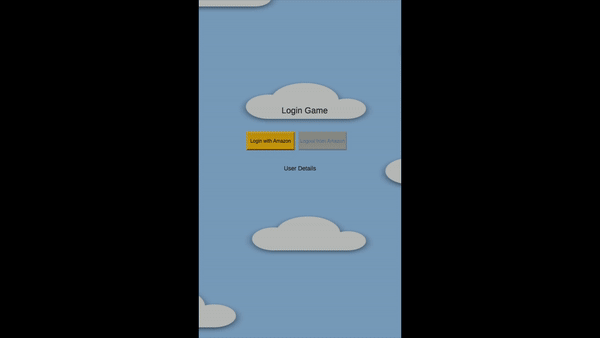

# 🎮 Login with Amazon Unity Game Demo

[](https://unity.com/)
[](https://developer.amazon.com/docs/login-with-amazon/android-docs.html)
[](LICENSE)

This project is a sample game developed in Unity to showcase how to integrate the Login with Amazon SDK in an Android app. The game is designed to work on Fire OS, Android, and Windows System for Android devices. 🎉




## 🚀 Getting Started

### Prerequisites

- [Unity 2022.3.10f1](https://unity.com/)
- Download [Login with Amazon SDK 3.1.2 zip file](https://developer.amazon.com/docs/login-with-amazon/android-docs.html#download-the-login-with-amazon-android-sdk)
- [An Amazon Developer Account](https://developer.amazon.com/)

### Build and test the demo

1. Clone the repository:
   ```bash
   git clone https://github.com/AmazonAppDev/login-with-amazon-unity-sample
   ```

2. Open the project in Unity.

3. Open the `SampleScene` scene located in `Assets/Scenes`. 

4. Create a new [Security Profile](https://developer.amazon.com/docs/login-with-amazon/register-android.html#create-a-new-security-profile).

5. Create your app in the Amazon Developer portal, and in 'New app Submission/Upload your app', you'll get an Appstore Certificate Hashes link. On clicking that link, you'll get the MD5 and SHA-256 of the Amazon signature with which your app will be signed when submitted. Use these hash values while adding [Android Settings to your Security Profile](https://developer.amazon.com/docs/login-with-amazon/register-android.html#add-android-settings) to get the API key.

6. Once your API key is created, place it in `Assets/assets/api_key.txt`.

7. Extract the login-with-amazon.jar fron the previously downloaded [Login with Amazon SDK 3.1.2 zip file](https://developer.amazon.com/docs/login-with-amazon/android-docs.html#download-the-login-with-amazon-android-sdk) and place it inside `LwaAuthenticationManagerBridge/bin`.

8. Build the game for the Android platform.

9. Install the built APK on any device with the Amazon AppStore.

## 🎮 How to Play

1. Open the application, and you'll find a 'Login with Amazon' button activated, while the 'Sign Out' button remains inactive.

2. Upon selecting the 'Login with Amazon' button, you'll be redirected to a browser where you'll be prompted to enter your Amazon credentials.

3. After successfully logging in, you'll be asked to grant permission for the application to access your customer profile information.

4. Upon granting permission, you'll be redirected back to the application, where your Account, Name, Email, and Zip Code details will be displayed.

5. Subsequently, the 'Sign Out' button will become active, allowing you to log out and remove your information by clicking it.

6. Upon completion, the 'Login with Amazon' button will be reactivated, while the 'Sign Out' button returns to an inactive state.

## 🔧 How to Integrate Login with Amazon

We integrated the Login with Amazon SDK in our Unity project by creating a wrapper following the [Unity plugin guidelines](https://docs.unity3d.com/Manual/PluginsForAndroid.html) and recommended code for Login with Amazon Java integration.

### Code Changes

1. Create a `LwaAuthenticationManagerBridge` folder inside `Plugins/Android`, where you'll be placing the JAR and other scripts.

2. Once the folder is created, download the [login-with-amazon.jar](https://developer.amazon.com/docs/login-with-amazon/android-docs.html#download-the-login-with-amazon-android-sdk) and place it inside `LwaAuthenticationManagerBridge/bin`.

3. Go to `Edit > Project Settings > Player > Android > Publishing Settings`, and check 'Custom Main Manifest', 'Custom Main Gradle Template', and 'Custom Gradle Setting Template'.

4. In `gradleTemplate.properties`, add `android.useAndroidX=true`.

5. In the `Assets` folder, create an `assets` folder and insert your API key as the only data in the `api_key.txt` file generated in Step 2.

6. In `mainTemplate.gradle`, add the following code snippet at the very end of the file:
   ```groovy
   dependencies {
       implementation 'androidx.appcompat:appcompat:1.0.0'
   }

   task copyAmazon(type: Copy) {
       def unityProjectPath = $/file:///**DIR_UNITYPROJECT**/$.replace("\\", "/")
       from unityProjectPath + '/Assets/assets/api_key.txt'
       into new File(projectDir, 'src/main/assets')
   }
   preBuild.dependsOn(copyAmazon)
   ```

7. In the folder created in Step 1, add three files that create a bridge between Login with Amazon Java APIs and Unity C# script. These code snippets can be refactored as per your requirements:
   - `UnityPlayerProxyActivity.java`: Create a custom Unity activity following the [Unity documentation](https://docs.unity3d.com/Manual/android-custom-activity.html) and integrate Login with Amazon as documented in the [official guide](https://developer.amazon.com/docs/login-with-amazon/use-sdk-android.html).
   - `LwaAuthManager.cs`: C# file to call the Java API for execution in Unity.
   - `UnityAuthListenerCallbackInterface.java`: Interface to handle authentication callbacks.

8. In `AndroidManifest.xml`, make the following changes:
   - Replace the application's activity `android:name` with `<packageName>.UnityPlayerProxyActivity`.
   - Add the [WorkflowActivity](https://developer.amazon.com/docs/login-with-amazon/create-android-project.html#add-a-workflowactivity-to-your-project). Don't forget to replace `${applicationId}` with your package name for this app.
   - Add network permissions:
     ```xml
     <uses-permission android:name="android.permission.INTERNET"/>
     <uses-permission android:name="android.permission.ACCESS_NETWORK_STATE"/>
     ```

## 🧪 Testing Your App

### Test Your App Locally

1. Add Android Settings to your security profile in the Developer portal by using the MD5 and SHA-256 values of your debug signature. An API key will be generated, which needs to be placed in the `Assets/assets/api_key.txt` file.

2. Build the APK and sign it with the debug signature.

3. Install the APK on your device and test.

### Test Your App with Live App Testing (LAT)

1. Add Android Settings to your security profile in the Amazon developer portal by using the MD5 and SHA-256 values present in Appstore Certificate Hashes by following the Pre-requisite Step 3. An API key will be generated, which needs to be placed in the `Assets/assets/api_key.txt` file.

2. Build your APK and submit it for [Live App Testing (LAT)](https://developer.amazon.com/docs/app-testing/live-app-testing-getting-started.html).

3. Once the LAT is submitted, after a few minutes, you'll receive an email to test your app on the device.

## 🤝 Contributing

We welcome contributions to enhance the project! If you'd like to contribute, please follow these steps:

1. Fork the repository.
2. Create a new branch for your feature or bug fix.
3. Make your changes and commit them with descriptive messages.
4. Push your changes to your forked repository.
5. Submit a pull request to the main repository.

For major changes, please open an issue first to discuss the proposed changes.

## 📄 License

This project is licensed under the [MIT-0 License](LICENSE).

## Get support

If you found a bug or want to suggest a new [feature/use case/sample], please [file an issue](../../issues).

If you have questions, comments, or need help with code, we're here to help:
- [Ask questions](https://community.amazondeveloper.com/c/amazon-appstore/appstore-questions/20) in the Amazon developer community space
- Ask questions on Stack Overflow using the [amazon-appstore](https://stackoverflow.com/questions/tagged/amazon-appstore) tag


### Stay updated
Get the most up to date Amazon Appstore developer news, product releases, tutorials, and more:

* 📣 Follow [@AmazonAppDev](https://twitter.com/AmazonAppDev) and [our team](https://twitter.com/i/lists/1580293569897984000) on [Twitter](https://twitter.com/AmazonAppDev)
* 📺 Subscribe to our [Youtube channel](https://www.youtube.com/amazonappstoredevelopers)
* 📧 Sign up for the [Developer Newsletter](https://m.amazonappservices.com/devto-newsletter-subscribe)

## Authors

- [Garima Rai](https://github.com/Garirai)
- [Giovanni Laquidara](https://github.com/giolaq)
